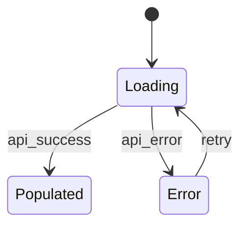

# Step 1 — UI Contract Generation (v2)

<!-- beads-id: br-gatecheck-g1 -->

> **Pipeline position:** Step 1 of 12 • Requires → Step 0 output • Leads to → Step 2 (Contract Compile)

## Input

- `docs/PRDs/feature-x.normalized.json` (from Step 0)

## Processing

### 1.1 Generate `contract.yaml`

Create the primary contract with these required sections:

```yaml
feature: <feature-name>
beads_id: <universal-id-from-prd>
routes:
  - /route-1
  - /route-2

components:
  required:
    - id: <component-id>
      selector: "[data-ds-id='ds:comp:<id>']"
      critical: true|false

viewports:
  - { name: mobile, width: 390, height: 844 }
  - { name: tablet, width: 768, height: 1024 }
  - { name: desktop, width: 1440, height: 900 }

visual_diff:
  global_threshold: 0.2%
  critical_threshold: 0.05%
  mask:
    - "[data-ds-id='ds:comp:clock-001']"

accessibility:
  wcag: AA
  enforce_focus_visible: true

state_transitions:
  - from: loading
    to: populated
    trigger: api_success
  - from: loading
    to: error
    trigger: api_error
```

### 1.2 Generate ASCII Wireframes (GAP-41/42 — Detail Requirements)

For **each screen × each state** (default, loading, error, empty at minimum), produce a **detailed** text-based layout diagram. Each block MUST map to a real `data-ds-id` component.

> **MANDATORY DEPTH RULES:**
> - Wireframes with >3 components MUST show ≥3 nesting levels (page → section → components → sub-elements).
> - Every block MUST include internal structure: column headers for tables, button labels, placeholder text for inputs — not just a block name.
> - Column ratios MUST be annotated using `[60%]` / `[40%]` markers on split sections.
> - Padding/spacing intent MUST be shown using `│ pad │` markers or `(16px)` annotations.
> - No "stub" blocks allowed — blocks that contain only a label with no sub-elements are rejected for complex components (tables, forms, card grids).

**Reference Example — Dashboard Default State (MINIMUM quality bar):**

```text
Screen: dashboard_default  |  Viewport: desktop (1440×900)
┌─────────────────────────────────────────────────────────────────────────┐
│ [Top Nav]  ds:comp:top-nav-001                                         │
│ ┌─────────────┬──────────────────────────────────────┬───────────────┐ │
│ │ 🔵 Logo     │ 📊 Dashboard  📋 Tasks  📈 Reports  │ 👤 Avatar ▾  │ │
│ └─────────────┴──────────────────────────────────────┴───────────────┘ │
├─────────────────────────────────────────────────────────────────────────┤
│ (16px padding)                                                         │
│ [KPI Cards Row]  ds:comp:kpi-cards-001                                 │
│ ┌────────────────┐ (12px) ┌────────────────┐ (12px) ┌────────────────┐│
│ │ Coverage       │        │ Tasks Done     │        │ Gaps Found     ││
│ │   ████ 85%     │        │   98 / 142     │        │   ⚠ 5 items    ││
│ │ ▲ +3% vs last  │        │ ▲ +12 this wk  │        │ ▼ -2 resolved  ││
│ └────────────────┘        └────────────────┘        └────────────────┘│
│ (24px gap)                                                             │
│ ┌──────────────────────────────────── [60%] ──┬── [40%] ─────────────┐│
│ │ [Coverage Heatmap]  ds:comp:heatmap-001     │ [Task Progress]      ││
│ │                                             │ ds:comp:progress-001 ││
│ │ PRD-01 [████████████ 90%]  ✓                │                      ││
│ │ PRD-02 [████████░░░░ 75%]                   │  ● Done: 98 (69%)    ││
│ │ PRD-03 [██████░░░░░░ 60%]  ⚠                │  ● In Progress: 24   ││
│ │                                             │  ● Blocked: 8  🔴    ││
│ │  └ s1.1 [████████████ 100%] ✓               │  ● Not Started: 12   ││
│ │  └ s1.2 [████████░░░░ 80%]                  │                      ││
│ │  └ s1.3 [████░░░░░░░░ 40%]  🔴              │  [Gantt timeline]    ││
│ │                                             │  ══════▶             ││
│ ├─────────────────────────────────────────────┼──────────────────────┤│
│ │ [Knowledge Graph]  ds:comp:graph-001        │ [Gap Analysis]       ││
│ │                                             │ ds:comp:gaps-001     ││
│ │     ○PRD ──── ◇Plan ──── □Task              │                      ││
│ │      │         │          │                 │ ! PRD-02 s3.4: no    ││
│ │     +Docs    +Code      +CI                │   plan element       ││
│ │                                             │ ! PRD-03 s2.1: no    ││
│ │  [Click node → side panel]                  │   tasks decomposed   ││
│ │                                             │ ! bd-a1: blocked 5d  ││
│ └─────────────────────────────────────────────┴──────────────────────┘│
│ (16px padding)                                                         │
└─────────────────────────────────────────────────────────────────────────┘
```

**Per-State Variation — Dashboard Loading State (REQUIRED):**

```text
Screen: dashboard_loading  |  Viewport: desktop (1440×900)
┌─────────────────────────────────────────────────────────────────────────┐
│ [Top Nav]  ds:comp:top-nav-001                                         │
│ ┌─────────────┬──────────────────────────────────────┬───────────────┐ │
│ │ 🔵 Logo     │ 📊 Dashboard  📋 Tasks  📈 Reports  │ 👤 Avatar ▾  │ │
│ └─────────────┴──────────────────────────────────────┴───────────────┘ │
├─────────────────────────────────────────────────────────────────────────┤
│ (16px padding)                                                         │
│ [KPI Cards Row — Skeleton]  ds:comp:kpi-cards-001                      │
│ ┌────────────────┐ (12px) ┌────────────────┐ (12px) ┌────────────────┐│
│ │ ░░░░░░░░░░░░░░ │        │ ░░░░░░░░░░░░░░ │        │ ░░░░░░░░░░░░░░ ││
│ │ ░░░░░░░░░░     │        │ ░░░░░░░░░░     │        │ ░░░░░░░░░░     ││
│ └────────────────┘        └────────────────┘        └────────────────┘│
│ (24px gap)                                                             │
│ ┌───────────────── [60%] ────────────────┬── [40%] ──────────────────┐│
│ │ [Heatmap Skeleton]                     │ [Progress Skeleton]       ││
│ │ ░░░░░░░░░░░░░░░░░░░░░░                │ ░░░░░░░░░░░░░░░░          ││
│ │ ░░░░░░░░░░░░░░░░░░                    │ ░░░░░░░░░░░░              ││
│ │ ░░░░░░░░░░░░░░                        │ ░░░░░░░░                  ││
│ ├────────────────────────────────────────┼───────────────────────────┤│
│ │ [Graph Skeleton]                       │ [Gaps Skeleton]           ││
│ │ ░░░░░░░░░░░░░░░░░░░░░░                │ ░░░░░░░░░░░░░░░░          ││
│ └────────────────────────────────────────┴───────────────────────────┘│
└─────────────────────────────────────────────────────────────────────────┘
```

> You MUST produce similar variations for **error state** (error banner + retry CTA) and **empty state** (empty illustration + onboarding guidance). Each variation must show the _actual_ structural difference — not just a label change.

### 1.2b Generate ASCII User Flow Diagrams — MANDATORY (GAP-44)

> **User Flows MUST be drawn as ASCII diagrams** in addition to Mermaid state diagrams. Mermaid diagrams show abstract state transitions; ASCII User Flow diagrams show the **spatial relationship between screens** during navigation — how users physically move through the UI.

For each major user journey in the PRD, produce an ASCII flow diagram:

```text
User Flow: "PRD Coverage Drill-Down"  (Journey 1)

┌──────────────────┐     ┌──────────────────┐     ┌──────────────────┐
│  Dashboard        │     │  Heatmap Panel    │     │  Section Detail   │
│  (4-panel view)   │     │  (Expanded)       │     │  (Side Panel)     │
│                   │     │                   │     │                   │
│ ┌──────┬────────┐ │     │ PRD-01 [90%] ✓   │     │ Section: s1.3     │
│ │Heatm │Progres │ │     │ PRD-02 [75%]     │     │ Coverage: 40%     │
│ ├──────┼────────┤ │     │  └ s1.1 [100%]   │     │                   │
│ │Graph │Gaps    │ │     │  └ s1.2 [80%]    │     │ Linked Tasks:     │
│ └──────┴────────┘ │     │  └ s1.3 [40%] 🔴 │     │ - br-42 (done)    │
│                   │     │                   │     │ - br-57 (blocked) │
│                   │     │                   │     │ - br-63 (open)    │
└──────────────────┘     └──────────────────┘     └──────────────────┘
        │                         │                         │
        │ ──[click Heatmap]──►    │                         │
        │                         │ ──[click section]──►    │
        │                         │                         │
        │ ◄──[click breadcrumb]── │                         │
        │                         │ ◄──[close panel]──      │
        │                                                   │
        │ ◄──────────[click "Back to Dashboard"]────────── │
```

**Mandatory rules for ASCII User Flows:**
- Each box represents a **screen state** (not an abstract state name — show the actual wireframe contents in miniature)
- Arrows labeled with `──[trigger action]──►` showing the user's interaction
- Return paths (back navigation, close, breadcrumb) MUST be shown
- At least one flow per major user journey in the PRD

### 1.3 Generate Mermaid Flow Diagram


Create a visual state/navigation flow:



### 1.4 Generate JSON Storyboard Trajectories — MANDATORY (GAP-28)

> **Storyboard trajectories are REQUIRED, not optional.** Gate A will reject any contract without ≥ 1 storyboard trajectory. If the PRD has no explicit flows, auto-generate a minimum trajectory from the PRD's first user journey.

For Tier 2 Agent Evaluation, provide **complete trajectories** that capture the full journey including tool calls and intermediate reasoning checkpoints — not just end states (GAP-14):

```json
[
  {
    "storyboard_id": "ds:flow:onboarding-001",
    "prd_journey_ref": "Journey 1: New User Registration",
    "trajectory_plan": [
      {
        "step": 1,
        "state": "empty_form",
        "action": "type_input",
        "target": "ds:comp:email-input",
        "reasoning_checkpoint": "Agent should verify input field is visible and enabled before typing"
      },
      {
        "step": 2,
        "state": "validating",
        "action": "click",
        "target": "ds:comp:submit-btn",
        "reasoning_checkpoint": "Agent should confirm the submit triggers loading state, not immediate error"
      },
      {
        "step": 3,
        "state": "error_toast",
        "assertion": "element_visible ds:comp:toast-error-001",
        "recovery_test": {
          "action": "dismiss_toast",
          "expected_state": "empty_form",
          "assert_no_reload": true
        }
      }
    ]
  }
]
```

> The Evaluator must capture the Implementor's **full conversation trace** (tool calls + args + reasoning interleaved) per iteration and store as `rollout-{id}-iteration-{n}.jsonl` in `docs/design/reports/` for RFT dataset assembly.

### 1.4 Generate Component Map

Map ASCII blocks → actual component selectors:

```json
{
  "top-nav": "[data-ds-id='ds:comp:top-nav-001']",
  "kpi-cards": "[data-ds-id='ds:comp:kpi-cards-001']",
  "chart": "[data-ds-id='ds:comp:chart-001']",
  "table": "[data-ds-id='ds:comp:positions-table-001']"
}
```

### 1.5 PRD ↔ Design System Conflict Detection (GAP-38)

Before emitting the contract, run a conflict scan:

1. For each color/style directive in the PRD (e.g., "button must be blue"), check if a matching DS token exists.
2. For each required component, verify it exists in `design-tokens.json`.
3. If conflicts found, emit a `PRD_DS_CONFLICT` list:

```markdown
## PRD ↔ DS Conflicts — feature-x

- CONFLICT: PRD requires "blue CTA" but `--ds-color-primary` = green. Options: (a) update token, (b) local override, (c) update PRD.
- CONFLICT: PRD references `ds:comp:data-export-btn` — not found in design-tokens.json.
```

**Gate A MUST surface this list.** Human decides resolution before Implementor starts. No silent resolutions allowed.

## Output (GAP-46 — Subdirectory Convention)

Detailed ASCII wireframes and user flows are split into individual files under a **feature contract directory** to keep each file under 400 lines.

| Artifact | Path |
| --- | --- |
| **Feature directory** | `docs/design/contracts/{feature-x}/` |
| README (index) | `docs/design/contracts/{feature-x}/README.md` |
| Contract YAML | `docs/design/contracts/{feature-x}/contract.yaml` |
| ASCII wireframes | `docs/design/contracts/{feature-x}/wireframes/{screen}--{state}--{viewport}.ascii.md` |
| ASCII user flows | `docs/design/contracts/{feature-x}/user-flows/j{N}-{journey-name}.ascii.md` |
| Flow diagram | `docs/design/contracts/{feature-x}/flow.mmd` |
| JSON Storyboard | `docs/design/contracts/{feature-x}/storyboards.json` |
| Component map | `docs/design/contracts/{feature-x}/component-map.json` |
| Conflict report | `docs/design/contracts/{feature-x}/prd-ds-conflicts.md` |

> **Naming Convention:** Screen, state, and viewport segments use double-dash `--` separator. Journey files prefixed with `j{N}-`. See spike doc §2.1 for full naming rules.

### Contract Quality Score Template (GAP-19)

After the Implementor completes its first run, rate the contract quality:

```json
{
  "contract_quality": {
    "implementor_clarification_requests": 0,
    "spec_gaps_found_during_implementation": 2,
    "storyboard_trajectories_count": 3,
    "conflict_items_resolved_at_gate_a": 1,
    "quality_score": 85,
    "notes": "Two state transitions were ambiguous — refine g1 template for next feature."
  }
}
```

Feed quality score back into `g1-contract-generation.md` iteration notes to improve contract completeness over time.

## Switching Rules

| Product Type      | Additional Requirements                    |
| ----------------- | ------------------------------------------ |
| **Web**           | Routes + responsive breakpoints mandatory  |
| **Mobile native** | Screen IDs + orientation + safe-area rules |
| **PWA**           | Add offline/rehydration state transitions  |

See [product-switching.md](./product-switching.md) for full details.

## Next Step

→ [g2-contract-compile.md](./g2-contract-compile.md)
